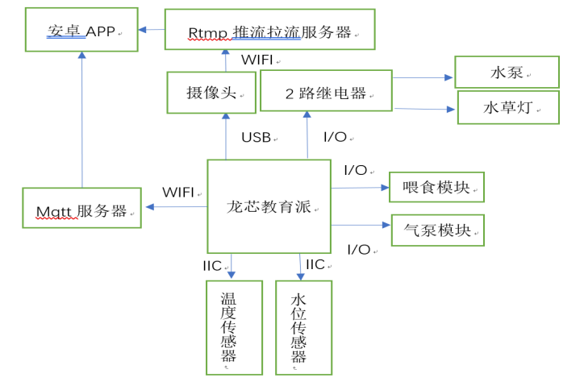

#基于 MQTT 协议的可视化两栖宠物养殖系统

## `随着人们生活质量日渐提高，饲养小宠物成了很多人的日常爱好，很多深水、半水龟有
着美丽背甲，活泼的性格，饲养它们所需的空间不大，是很多人饲养宠物的首要选择。然而，
龟对环境也有着一些自己的要求，诸如水温，水质，饲料，阳光等，不同的龟都有自己喜好
的环境和食物，饲养好它们需要一些必不可少的日常护理。但并非每个人都有时间照顾好这
些小动物。
如果能有一套智能控制系统，它是宠物龟的栖息之所，又能远程智能控制宠物龟的喂
食，调节环境的水温，水质 ，又能给主人传回宠物的图像，和宠物实时互动 是否能让养龟
的过程更加便捷有趣呢？`

##作品整体框图： 
本作品的主要分为三个部分：水缸检测控制电路，龙芯派信息处理模块，云服务器和 APP
控制模块。
